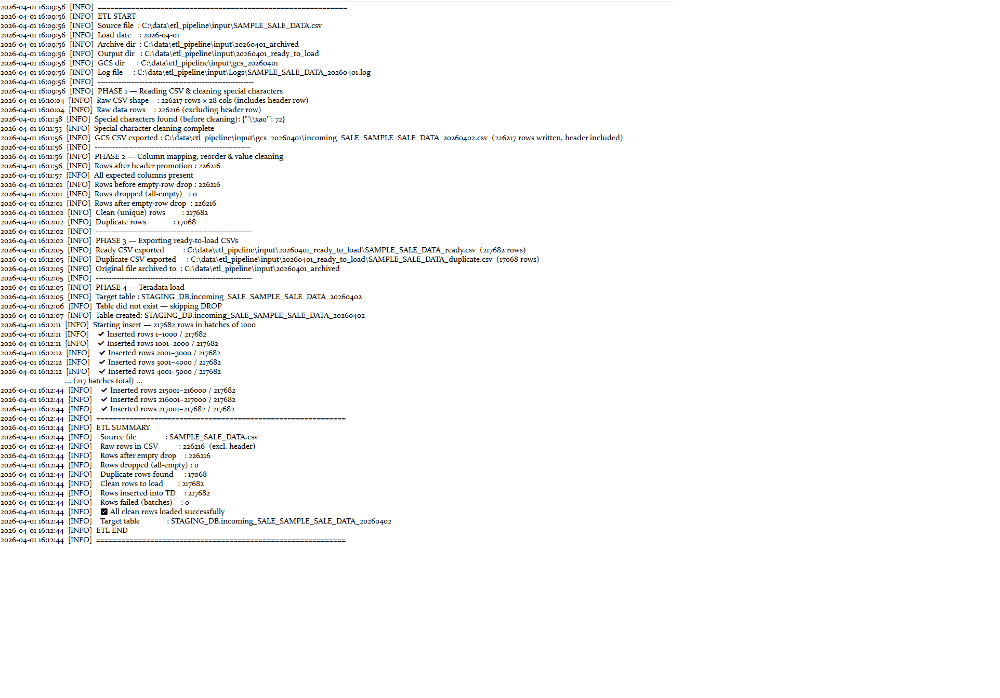

# E-Commerce Order ETL Pipeline — CSV to Teradata


A modular, production-grade ETL pipeline that ingests e-commerce order CSV files, performs data cleaning and validation, exports GCS-ready outputs, and bulk-loads clean data into a Teradata staging table.

## Architecture

```
Order CSV → Character Cleaning → Column Mapping & Type Coercion → Clean/Duplicate Split → GCS Export + Teradata Staging Table
```

## Project Structure

```
sales-etl-teradata/
├── main.py          # Entry point — orchestrates all phases
├── config.py        # Centralised configuration and column mappings
├── cleaner.py       # Unicode special character scrubbing
├── transformer.py   # Column mapping, type coercion, truncation, duplicate detection
└── loader.py        # Teradata connection and batch insert
```

## Pipeline Phases
1. **Extract** — reads raw CSV, scans and cleans 50+ Unicode characters incompatible with Teradata LATIN character set, exports GCS-ready file
2. **Transform** — promotes header, applies column mapping, type coercions, VARCHAR truncation, and null handling
3. **Export** — writes clean rows and duplicate rows to separate CSVs
4. **Load** — creates Teradata staging table and bulk-inserts clean rows in configurable batches with per-batch error recovery and rollback

## Features
- Modular architecture — each phase is independently testable
- Unicode-to-ASCII character replacement (50+ characters)
- Duplicate detection and separation
- Batch insert with error handling and rollback
- Structured logging to file and console
- Credentials managed via OS keyring and environment variables

## Setup
Set the following environment variables:
- `TD_USERNAME`: your Teradata username
- `TD_HOST`: your Teradata host

Install dependencies:
```bash
pip install -r requirements.txt
```

Run the pipeline:
```bash
python main.py
```

## Sample Run


## Note
This pipeline is designed to process e-commerce order CSV files.
Sample data is not included. To run locally, provide a CSV file
with the column structure defined in `COLUMN_MAP` in `config.py`.
