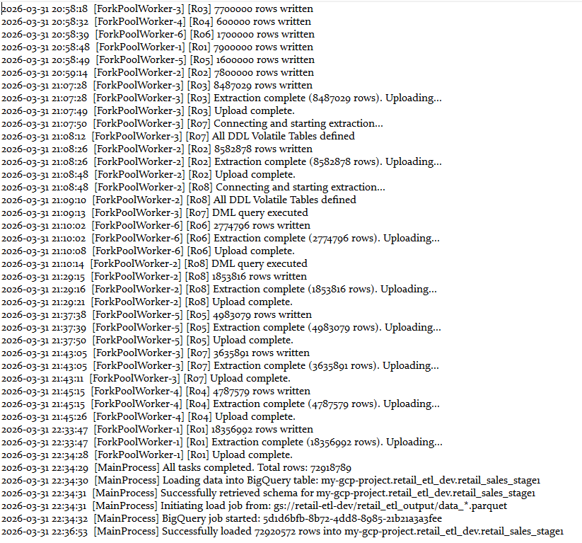

# Sales ETL Pipeline — Teradata to BigQuery


A multi-stage ETL pipeline that extracts order transaction and product data from Teradata,
stages it in Google Cloud Storage as Parquet, and loads it into BigQuery for downstream analysis.

## Architecture

```
Teradata → (multiprocessing) → Parquet → GCS → BigQuery
```

## Project Structure

```
retail-etl-on-prem-database-to-bigquery/
├── main.py                              # entry point — runs both stages in order
├── requirements.txt
├── stage1_extract_by_region/
│   ├── extract_by_region.py             # parallel extraction across regions
│   └── queries.py                       # DDL volatile tables + DML query templates
└── stage2_product_flag/
    └── product_flag_etl.py              # product catalogue extraction
```

## Pipeline Stages

### Stage 1 — Regional Order Extraction
- Spawns one worker process per region (up to 6 in parallel)
- Each worker builds Teradata volatile tables via DDL, then runs the DML query
- Results are streamed in 100k-row chunks into Snappy-compressed Parquet files
- Files are uploaded to GCS, then loaded into BigQuery with `WRITE_TRUNCATE`

### Stage 2 — Product Catalogue Extraction
- Extracts a product catalogue snapshot from Teradata
- Writes to a single Parquet file, uploads to GCS, loads into BigQuery

## Setup

Set the following environment variables:

```bash
export GCP_PROJECT_ID=your-gcp-project
export GCS_BUCKET=your-gcs-bucket
export BQ_DATASET=your-bq-dataset
export TD_SECRET_ID=your-secret-manager-secret-id
```

Store Teradata credentials in GCP Secret Manager as a JSON object:

```json
{
  "host": "your-teradata-host",
  "username": "your-username",
  "password": "your-password",
  "logmech": "TD2"
}
```

Install dependencies:

```bash
pip install -r requirements.txt
```

Run the pipeline:

```bash
python main.py
```

## Sample Run

6 worker processes running in parallel across 12 regions,
extracting a total of 72M+ rows from Teradata into BigQuery.



## Note

This pipeline is designed for a proprietary sales data environment.
Table names and business logic in `queries.py` are generalized for portfolio use.
Sample data is not included.
