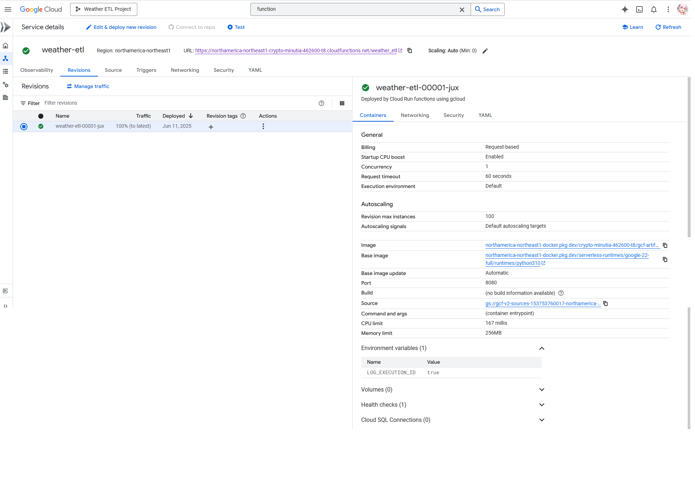
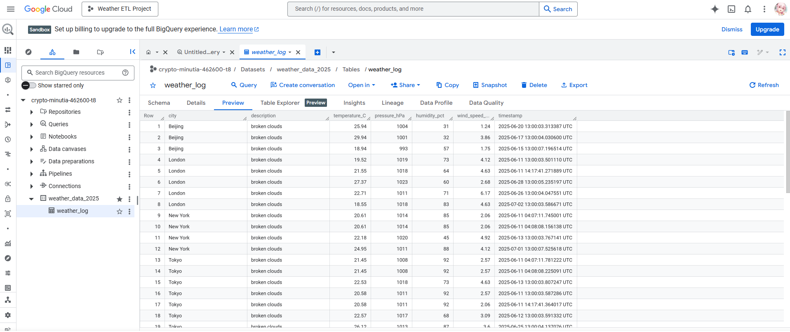

# Weather ETL Pipeline

A serverless ETL pipeline deployed on GCP Cloud Functions that extracts real-time weather data from OpenWeatherMap API and loads it into BigQuery for analysis.

## Architecture
OpenWeatherMap API → Cloud Functions (HTTP Trigger) → BigQuery

## Tech Stack
- GCP Cloud Functions
- BigQuery
- OpenWeatherMap API
- Python

## How It Works
1. Triggered via HTTP request
2. Fetches current weather data for 5 cities (Toronto, Beijing, London, New York, Tokyo)
3. Loads results into BigQuery table

## Deployment
### Cloud Functions (GCP)

### BigQuery Output

## Setup
Set the following environment variable in GCP Cloud Functions:
- `OPENWEATHER_API_KEY`: use your own OpenWeatherMap API key